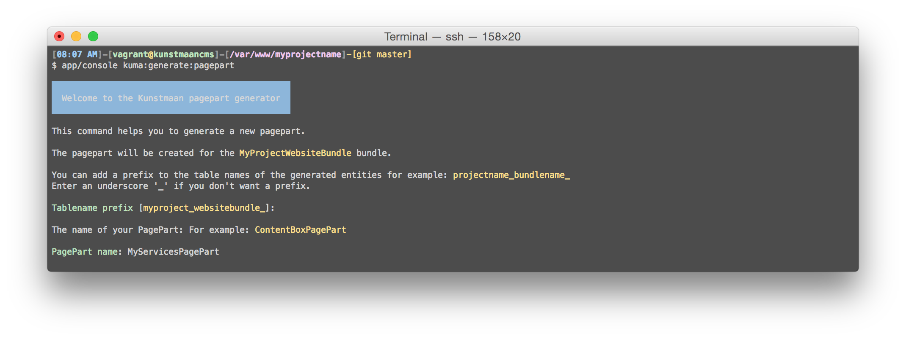
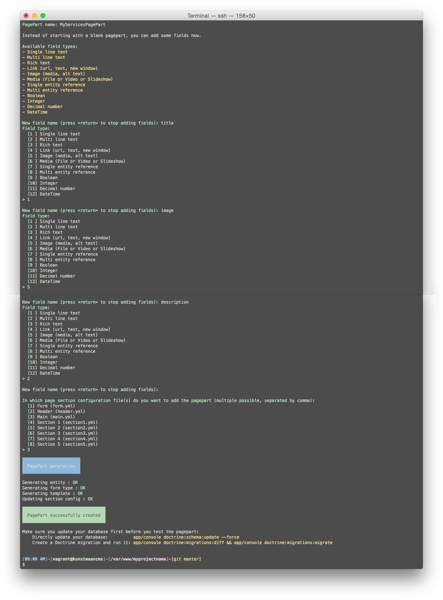
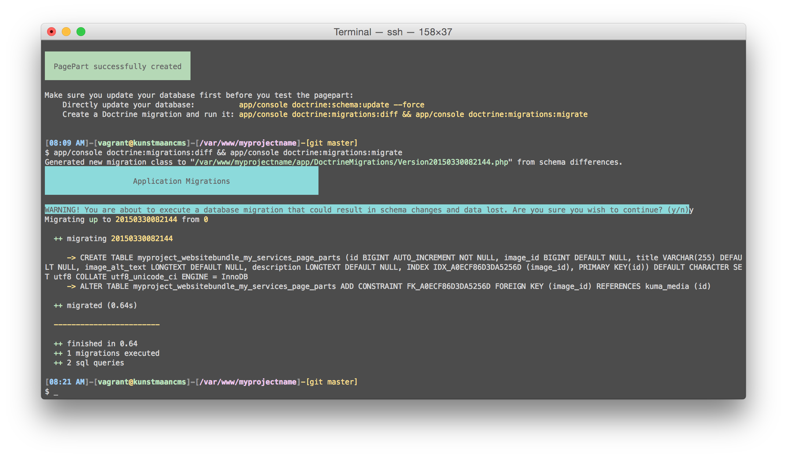

# Creating a page part


## What is a page part?

A piece of information that should be displayed on a page (/node), anywhere on the site, in a consistent and reusable way. So basically it's a page building block you can add to pages of your site, that allows non technical users to add content to the site. It can be as simple as a heading or an image or a complex combination of different fields that belong together.

Every page on your website can (optionally) contain one or more different page parts. You can limit the page parts to specific sections on specific pages as well if needed.


## Creating your first page part

Now, suppose we want to have a content page that displays an overview of the services that our virtual company offers.

Every service should have a separate page part, since you want to display them consistently and per service you want a title, an image and some text. So how would you go about creating this?

To make things easier, we created a page part generator that will generate the basic skeleton, and does all of the basic wiring, so go ahead and execute the following :

    app/console kuma:generate:pagepart

First this will ask for a table name prefix, just leave it as it's suggested by the generator.

Then it will ask for a name, this is the class name for your page part. It's best to use something sensible, preferably ending in PagePart, so let's call it the `MyServicesPagePart`.



Now the generator will ask for a list of fields to add to the page part, so just enter the following at the respective prompts:

- Field name : `title`,       field type : `1` (Single line text)
- Field name : `image`,       field type : `5` (Image)
- Field name : `description`, field type : `2` (Multi line text)

And finally press return at the field name prompt without entering a field name to continue.

Now you will be prompted to select the section(s) you want to add this page part to, for now just enter `3` (Main).



If all goes well, the necessary code should have been created, and you'll get a hint on how to update your database to reflect the changes that were made.  You can either forcibly update your database (which might make it harder to deploy, since you will have to manually alter the database when deploying) or you can create a migration for the change (which is advisable).

We prefer the latter, so go ahead and execute :

    app/console doctrine:migrations:diff
    app/console doctrine:migrations:migrate

This will create a migration and update your database. Now head on over to the back-end (`/app_dev.php/en/admin`) and have a look at the Content PageParts page (`/app_dev.php/en/admin/nodes/2`). If all went well, you should see 'Service'
at the bottom of the 'Add a pagepart' combobox and you should be able to add, edit and delete Service page parts as well.



## Modifying the generated page part template

Ok, all sweet and dandy, but the default template will probably not be what you would like it to be, so let's see how and where to change it.

Head on over to `src/MyProject/WebsiteBundle/Resources/views/PageParts/MyServicesPagePart` and have a look at the `view.html.twig` file located there. This file should contain the following :

```html
<div class="my-services-pp">
    <p>{{ resource.title }}</p>
    
    <p>{{ resource.description }}</p>
</div>
```

We would like to have the service title as a second level heading, the image should be displayed as a 150x150 pixels thumbnail and the description should keep new lines entered in the text area (but still be plain text). So let's modify
the template accordingly :

```html
<div class="my-services-pp">
    <h2>{{ resource.title }}</h2>
	
    <p>{{ resource.description|nl2br }}</p>
</div>
```

Since we're using an [Imagine][1] filter to create a thumbnail of the image we selected, we'll have to edit the configuration settings to define it, so open `app/config/config.yml` and look for the liip_imagine section inside. By default it will look like this :

```yml
liip_imagine:
    cache_prefix: uploads/cache
    driver: imagick
    data_loader: filesystem
    data_root: %kernel.root_dir%/../web
    formats : ['jpg', 'jpeg','png', 'gif', 'bmp']
    filter_sets:
	optim:
	    quality: 85
	    format: jpg
	    filters:
		strip: ~
	optimjpg:
	    quality: 85
	    format: jpg
	    filters:
		strip: ~
	optimpng:
	    quality: 85
	    format: png
	    filters:
		strip: ~
```

So let's add an entry named `my_services_pp_thumbnail` to the `filter_sets` in `app/config/config.yml` :

```yml
...
liip_imagine:
    ...
    filter_sets:
    ...
	my_services_pp_thumbnail:
	    quality: 80
	    filters:
		thumbnail: { size: [150, 150], mode: outbound }
```

Now, clear the cache.

    app/console cache:clear

And have a look at the front-end (`/app_dev.php/en/content-pageparts`), the Service page part should now be rendered as just defined.

For more information on the Liip Imagine bundle configuration options refer to the [Liip Imagine Bundle documentation][2].


## Overriding a page part template

Suppose you want to use one of our default page parts, but change the rendering to your liking. You could of course create a custom version of the page part from scratch, but it could be a lot simpler to just override the template. So, how would you do that?

It's quite simple actually. Let's have a look at the TocPagePart, which renders a simple table of contents containing all second level headings (HeaderPageParts where niv equals 2) on a page.

The default template (located in `vendor/kunstmaan/pagepart-bundle/Kunstmaan/PagePartBundle/Resources/views/TocPagePart/view.html.twig`) looks like this :

```html


    
	
	  
	      
	  
	
    
    
	<div class="toc-pp">
	    <ul>{{ tocContent|raw }}</ul>
	</div>
    

```

Now suppose you want to have an ordered list instead of the unordered one.

First create the folder that will contain the template override, in the root folder of your web application :

    mkdir -p app/Resources/KunstmaanPagePartBundle/views/TocPagePart

Now create a new `view.html.twig` file that contains the code you wish to use to render the page part :

```html


    
	
	  
	      
	  
	
    
    
	<div class="toc-pp">
	    <ol>{{ tocContent|raw }}</ol>
	</div>
    

```

Clear the cache :

    app/console cache:clear

And reload the Content PageParts page (`/app_dev.php/en/content-pageparts`). The table of contents on top of the page should now be rendered as an ordered list instead of the default unordered one.

It's that simple! You just have to make sure you use the correct page part template folder names (watch out for case sensitivity issues)...


## Under the hood

- `src/YourVendor/YourWebsiteBundle/Resources/config/pageparts` contains the YML files for every page section.
- `src/YourVendor/YourWebsiteBundle/Entity/PageParts` contains the source code of the page part entities.
- `src/YourVendor/YourWebsiteBundle/Form/PageParts` contains the source code of the AdminTypes for your page parts (ie. the definition of the page part entry form).
- `src/YourVendor/YourWebsiteBundle/Resources/views/PageParts` contains the Twig views for your page parts (every page part will be stored in a separate folder).
- `app/Resources/KunstmaanPagePartBundle/views` contains template overrides you defined.


[1]:  http://imagine.readthedocs.org/en/latest/
[2]:  https://github.com/liip/LiipImagineBundle/blob/master/Resources/doc/index.md

<p align="right"><a href="./04-02-creating-an-adminlist.md">Next chapter: Creating an adminlist &raquo;</a></p>